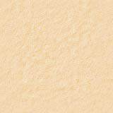
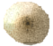
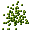

<h1>
Ants
</h1>

<h2>
Ein Informatik-Projekt von Robin Wagner und Finn Westphal
</h2>

<p></p>

<ul>
    <li><a href= "#Einleitung"> 1. Einleitung: Anforderungen und Elemente des Spiels</a></li>
        <ul>
        <li><a href= "#Das Spiel und die Dokumentation"> 1.1 Das Spiel und die Dokumentation</a></li>
        <li><a href= "#Syntax und Funktionsweise von Java"> 1.2 Syntax und Funktionsweise von Java</a></li>
        </ul>
    <li><a href= "#Umsetzung"> 2. Umsetzung</a></li>
        <ul>
        <li><a href= "#Das Szenario"> 2.1 Das Szenario</a></li>
           <ul>
           <li><a href= "#Erstellen einer Welt"> 2.1.1 Erstellen einer Welt</a></li>
           <li><a href= "#Objekte in der Welt"> 2.1.2 Objekte in der Welt</a></li>
           </ul>
        <li><a href= "#Die Creature-Klasse"> 2.2 Die Creature-Klasse</a></li>
           <ul>
           <li><a href= "#Code-Zusammenfassung Die Creature-Klasse"> 2.2.1 Code-Zusammenfassung</a></li>
           </ul>
        <li><a href= "#Die Ants-Klasse"> 2.3 Die Ants-Klasse</a></li>
           <ul>
           <li><a href= "#Code-Zusammenfassung Die Ants-Klasse"> 2.3.1 Code-Zusammenfassung</a></li>
           </ul>
    <li><a href= "#Die AntHill-Klasse"> 2.4 Die AntHill-Klasse</a></li>
    <li><a href= "#Die Food-Klasse"> 2.5 Die Food-Klasse</a></li>
        <ul>
        <li><a href="#Code-Zusammenfassung Die Food-Klasse"> 2.5.1 Code-Zusammenfassung</a></li>
        </ul>
    </ul>
    <li><a href= "#Stundenübersicht"> 3. Stundenübersicht</a></li>
<li><a href= "#Quellen"> 4. Quellen</a></li>
</ul>

<h2>
<a id="Einleitung">1. Einleitung</a>
</h2>

<h3>
<a id="Das Spiel und die Dokumentation"> 1.1 Das Spiel und die Dokumentation</a>
</h3>

<p>
<i>Ants</i> ist eine Simulation zur Modellierung des biologischen Verhaltens einer Ameisenkolonie. Ameisen sind in der Lage, bei ihrer Futtersuche Botenstoffe, sogenannte Pheromone, aufzusenden. Werden die Ameisen fündig, kehren sie mit einem Teil des Futters zu ihrem Ameisenhügel zurück und hinterlassen dabei eine Spur aus Pheromonen, sodass andere Ameisen im Ameisenstaat das Futtervorkommen ebenfalls finden können. Auf diese Weise wird die Nahrungssuche deutlich beschleunigt, da die einzelnen Ameisen zum Futter hingeführt werden können und nicht rein zufällig auf Nahrung stoßen. Ziel der Simulation <i>Ants</i> ist es, dieses Suchverhalten zu simulieren.
</p>

<p>
Dieses Projekt beruht auf dem Kapitel 9.2 aus dem Buch <a href="https://www.greenfoot.org/book/">"Einführung in Java mit Greenfoot"</a>
 von Michael Kölling. In diesen Kapitel geht es um das Programmieren von Simulationen. Hierfür ist ein unvollständiges namens <i>ants</i> Szenario vorgegeben, das man durch eigene Ideen ergänzen soll, um die Simulation fertigzustellen. Wir haben bei der Bearbeitung des Projektes dieses Szenario als Basis für unsere Simulation verwendet. Dabei haben wir die Klasse <i>AntHill</i> übernommen, da es keinen Sinn macht, sie erneut zu programmieren. Im Folgenden werden wir schrittweise erläutern , wie wir beim Erstellen der Simulation vorgegangen sind. Es macht Sinn, sich in der angegeben Reihenfolge mit dem Dokument zu beschäftigen, um unsere Gedankengänge nachzuvollziehen. Da es wenig Sinn macht, jede Methode in allen Einzelheiten zu definieren, erklären wir in einer Tabelle die vorgefertigten Grundmethoden von <i>Greenfoot</i>, die wir zur Programmierung der Simulation verwendet haben. Aus diesen Grundmethoden setzt sich unser Programmier-Code zusammen, deren Funktion wir als Grundwissen vorraussetzen.
</p>

<p></p>


<p>		
In den folgenden Ausführungen werden wir schrittweise beschreiben, wie wir bei der Programmierung der Simulation vorgegangen sind. Es macht Sinn, sich in der angegeben Reihenfolge mit dem Dokument zu beschäftigen, um unsere Gedankengänge nachzuvollziehen. 
</p>

<h3>
<a id="Syntax und Funktionsweise von Java"> 1.2 Syntax und Funktionsweise von Java</a>
</h3>

<p>
Die Programmierumgebung <i>Greenfoot</i> basiert auf der objektorientierten Blockprogrammiersprache <i>Java</i>. Ziel dieser Umgebung ist es, mit relativ einfachen Mitteln und ohne Vorkenntnisse objektorientierte Simulationskonzepte zu programmieren. Für das bessere Verständnis erklären wir kurz den generellen Aufbau und die Syntax von <i>Java</i>.		
</p>		
 		
<p>		
Java ist aus Blöcken aufgebaut, die im Syntax durch geschweifte Klammern gekennzeichnet werden. Der Inhalt dieser Blöcke kann Anweisungen und Befehle, aber auch weitere Blöcke enthalten. Auf diese Weise ist eine verschachtelte Blockstruktur mit mehreren Ebenen möglich. Der Vorteil einer Block-Programmierung ist, dass Syntax-Fehler leichter indentifiziert werden können, da nur einzelne Blöcke nicht ordnungsgemäß funktionieren und nicht der gesamte Code defekt ist.		
</p>
 		
```javascript
Anweisung
{
    Anweisung
    {
    	Anweisung
    }
}
```

<h3>
<a id="Verwendete Methoden"> 1.3 Verwendete Methoden</a>
</h3>

<table>
    <tr>
    <th>Rückgabetyp</th>
    <th>Methode</th>
    <th>(</th>
    <th>Parameter</th>
    <th>)</th>
    <th>Funktion</th>
    </tr>
    <tr>
    <td>void</td>
    <td>super</td>
    <td>(</td>
    <td>Abmessungen des Szenarios in Pixeln in x- und y-Richtung ein boolscher Literal (x, y)</td>
    <td>)</td>
    <td>Definiert die Welt-Klasse als Hauptklasse des Szenarios und legt dessen Größe in Pixeln und durch einen weiteren booleschen Literal fest, dass die minimalen bzw. die maximalen Koordinaten des Szenarios Grenzen für die Objekte in der Welt darstellen</td>
    </tr>
    <tr>
    <td>void</td>
    <td>addObject()</td>
    <td>(</td>
    <td>Koordianten des Obejektes, das hinzugfügt werden soll (int x, int y)</td>
    <td>)</td>
    <td>fügt ein Objekt einer bestimmten Klasse in die Welt hinzu</td>
    </tr>
    <tr>
    <td>void</td>
    <td>act</td>
    <td>(</td>
    <td></td>
    <td>)</td>
    <td>wird ständig ausgeführt, solange der "Run"-Botton in Greenfoot betätigt wird</td>
    </tr>
    <tr>
    <td>void</td>
    <td>getWorld</td>
    <td>(</td>
    <td></td>
    <td>)</td>
    <td>ruft Methoden ab, die nur in der Weltklasse ausgeführt werden können</td>
    </tr>
    <tr>
    <tr>
    <td>int</td>
    <td>getX</td>
    <td>(</td>
    <td></td>
    <td>)</td>
    <td>gibt die akutuellen Koordinaten eines x-Klassenobjektes zurück</td>
    </tr>
    <tr>
    <td>int</td>
    <td>getY</td>
    <td>(</td>
    <td></td>
    <td>)</td>
    <td>gibt die akutuellen Koordinaten eines y-Klassenobjektes zurück</td>
    </tr>
    <tr>
    <td>void</td>
    <td>move</td>
    <td>(</td>
    <td>Ganzzahlige Zahl, deren Betrag das Tempo und dessen Vorzeichen die Richtung bestimmt.</td>
    <td>)</td>
    <td>Bewegt, abhängig von ihrem Parameter, ein Objekt einer Klasse entlang seiner Ausrichungsachse</td>
    </tr>
    <tr>
    <td>void</td>
    <td>move</td>
    <td>(</td>
    <td>Ganzzahlige Zahl, deren Betrag den Winkel und dessen Vorzeichen die Richtung bestimmt.</td>
    <td>)</td>
    <td>Lässt ein Objekt pro Ausführung um den als Parameter angegebenen Winkel rotieren.</td>
    </tr>
    <tr>
    <td>void</td>
    <td>if</td>
    <td>(</td>
    <td>Bedingungsparameter</td>
    <td>)</td>
    <td>führt den nachfolgenen Schleifenrumpf { ... } nur aus, wenn alle Bedingungsparameer erfüllt sind</td>
    </tr>
    <tr>
    <td>void</td>
    <td>else</td>
    <td>(</td>
    <td></td>
    <td>)</td>
    <td>sind die Bedingungen einer if-Methode nicht erfüllt, werden stattdessen die Methoden im Schleifenrumpf der else-Methode ausgeführt</td>
    </tr>
    <tr>
    <td>void</td>
    <td>setImage</td>
    <td>(</td>
    <td>Dateiname der Bilddatei</td>
    <td>)</td>
    <td>legt die Bilddabei eines bestimmten Objektes fest</td>
    </tr>
    <tr>
    <td>void</td>
    <td>while</td>
    <td>(</td>
    <td>Bedingungsparameter</td>
    <td>)</td>
    <td>führt Methoden in folgenden Methodenrumpf aus, solange die Bedingunsparameter erfüllt sind</td>
    </tr>
</table>

```javascript
Anweisung
{
    Anweisung
    {
    	Anweisung
    }
}
```

<p>
Wir programmieren unser Projekt "<i>Ants</i>" in der Programmierumgebung "Greenfoot", die auf der objektorientierten Programmiersprache Java basiert. Zunächst haben wir festgelegt, welche Größe, welches Format und welche Auflösung unsere Welt haben soll. Unsere Simulation soll über eine klassische Auflösung und ein klassisches Seitenverhälnis verfügen, damit es auf jedem Computer spielbar ist. Wir haben uns deswegen für das Seitenverhältis von 1/1 und eine Auflösung von 640 * 640 Pixeln entschieden. Diese Bildeigenschaften sind von den meisten aktuellen Displays umsetzbar.
</p>

<h2>
<a id="Umsetzung"> 2. Umsetzung</a>
</h2>

<h3>
<a id= "Das Szenario"> 2.1 Das Szenario</a>
</h3>


<h4>
<a id= "Erstellen einer Welt"> 2.1.1 Erstellen einer Welt</a>
</h4>

<p>
Mit dem Konstruktor <i>public</i> erstellen wir eine Welt-Klasse namens AntWorld und durch die Methode <i>import greenfoot.*; </i> geben wir an, dass diese Klasse in das Szenario implementiert werden soll. Fehlt diese Methode oder wird sie verändert, so würde diese Klasse beim Start des Programmes nicht geladen werden. Hinter jeder Klasse stehen mindestens eine geöffnete und eine geschlossene Klammer, die zusätzliche Parameter enthalten können. Die Referenz <i>super</i> sorgt dafür, dass alle Eigenschaften der Super- oder Hauptklasse auf alle anderen Klassen übertragen werden können. In diesem Fall ist die Super-Klasse die generierte Welt. Diese Anweisung benötigt weitere Parameter für ihre Funktionalität und zwar die Auflösung der generierten Welt und das Verhältnis zwischen Pixeln und Zellen des Zellen-Koordinatensystems, das deckungsgleich zur generierten Welt erstellt wird. Wir wollen dieses Verhältnis auf 1:1 festlegen, sodass eine Zelle einem Pixel entspricht. Um diese Parameter dem Konstruktor zur Verfügung zu stellen, schreiben wir nach super in Klammern (640, 640, 1, true). Der erste Parameter definiert die Anzahl der Pixel entlang der x-Achse, der zweite nach dem Komma die Pixelanzahl in y-Richtung und der dritte Parameter "1" sagt aus, dass eine Zelle die Größe von einem Pixel in x- und y- Richtung besitzt. Das Größenverhältnis zwischen Zellen und Pixeln beträgt also 1:1. Wir haben aber nicht die Koordinaten 640 benutzt, sondern eine feste Größe der Welt durch die Variable <i>WORLDSIZE</i> auf 640 festgelegt, die wir später weiter verwendet haben. Durch den Parameter <i>true</i> erreichen wir, dass die Asteroiden und auch die Rakete zunächst nicht aus der Welt verschwinden können, da die Grenzen der Welt für sie eine Barriere darstellen. In dieser Zeile steht ein Semikolon, das verschiedene Methoden voneinander trennt. Ein Hintergrund der Welt war durch das Herunterladen von Greenfoot Ants Project auf der Greenfoot Website schon vorgegeben und passt zum Ameisen-Szenario, sodass wir diesen nicht verändern mussten. Durch die Methode <i>setPaintOrder</i> können wir die Farbgebungsaufträge der Welt und der Ants Klasse aufnehmen. Die Reihenfolge der Parameter legt fest, welche Objekte in der Welt bei Überschneidung in den Hinergrund rücken. In unserem Fall rückt die AntHill-Klasse in den Hintergrund der Ant-Klasse. Außerdem wird hier eine von uns erstellte Methode <i>scenario1()</i> aufgerufen.
</p>

```javascript

import greenfoot.*;

public static final int WORLDSIZE = 640;
    {
     public AntWorld()
    {
        super(WORLDSIZE, WORLDSIZE, 1,false);
        setPaintOrder(Ant.class, AntHill.class);
        scenario1();
    }
    }
```

<p></p>

<h4>
<a id= "Objekte in der Welt">2.1.2 Objekte in der Welt</a>
</h4>

Bisher enthält unsere Welt noch keine Objekte, die agieren können und für unser Spiel relevant sind. Wir benötigen in jedem Fall zunächst eine <i>Ants</i>, <i>AntHill</i>, <i>Pheromon</i> und <i>Food</i>-Klasse in unserer Welt. Da die Ameisen immer aus ihrem Ameisenhügel spawnen sollen, legen wir die Koordinaten der Ameisenhügel mithilfe des Befehls <i>addObject</i> fest. Die Methode <i>addObject</i> benötigt bestimmte Parameter für ihre Funktionalität. Zu diesen zählt zum Einen die Bezeichnung des zu generierenden Objektes einer Klasse und seine Position in der Welt. Hierzu wird nach addObject in Klammern die jeweilige Klasse mit dem Aufdruck new davor genannt, welcher als Referenz festlegt, dass ein Objekt dieser Klasse hinzugefügt werden soll. Schließlich geben zwei Parameter, durch Kommata getrennt, die Koordinaten des jeweiligen Objekts an. Diese Koordinaten haben wir so gewählt, dass die Ameisenhügel jeweils ein bisschen auseinander liegen. Außerdem sollen zu Beginn Futterhaufen für die Ameisen vorhanden sein. Diese haben wir so gewählt, dass sie etwas auseinander und auf der ganzen Karte verteilt liegen. Es sollten außerdem nicht zu wenige Futterhaufen sein, da die Ameisen diese sonst zu schnell leeren.

```javascript

import greenfoot.*;
public void scenario1()
{
    addObject(new AntHill(), WORLDSIZE / 2, WORLDSIZE / 2);
    addObject(new AntHill(), WORLDSIZE / 4, WORLDSIZE / 4);
    addObject(new Food(), 200, 200);
    addObject(new Food(), 50, 50);
    addObject(new Food(), 300, 50);
    addObject(new Food(), 500, 200);
    addObject(new Food(), 300, 275);
    addObject(new Food(), 300, 350);
    addObject(new Food(), 350, 400);
    addObject(new Food(), 150, 400);
    addObject(new Food(), 400, 550);
    addObject(new Food(), 550, 500);
}
```

<p>
Zusammengefasst ergibt sich für die World-Klasse:
</p>

```javascript
import greenfoot.*;

public static final int WORLDSIZE = 640;
public AntWorld()
{
    super(WORLDSIZE, WORLDSIZE, 1,false);
    setPaintOrder(AntWorld.class, Ant.class);
    scenario1();
}
public void scenario1()
{
    addObject(new AntHill(), WORLDSIZE / 2, WORLDSIZE / 2);
    addObject(new AntHill(), WORLDSIZE / 4, WORLDSIZE / 4);
    addObject(new Food(), 200, 200);
    addObject(new Food(), 50, 50);
    addObject(new Food(), 300, 50);
    addObject(new Food(), 500, 200);
    addObject(new Food(), 300, 275);
    addObject(new Food(), 300, 350);
    addObject(new Food(), 350, 400);
    addObject(new Food(), 150, 400);
    addObject(new Food(), 400, 550);
    addObject(new Food(), 550, 500);
}
```
 
<h3>
<a id= "Die Creature-Klasse"> 2.2 Die Creature-Klasse</a>
</h3>

<p>
Die <i>Creature</i>-Klasse ist die Oberklasse der Ameinsen (<i>Ants</i>). Ihre Methoden werden an die Ameisen-Klasse vererbt. Methoden in der <i>Creature</i>-Klasse lassen sich deshalb von den Ameisen anrufen. Das Erstellen von einer Hierarchie innerhalb der Klassen hilft dabei, den Code des Szenarios übersichtlicher zu gestalten. Die Geschwindigkeit der Ameisen soll zufällig sein, jedoch sollen die Ameisen nicht stehen bleiben. Wir haben dazu die Methode <i>Speed()</i> erstellt die eine zufällige Zahl zwischen 1 und 4 durch eine Integre-Variable names <i>SPEED</i> zurückgibt. Hierfür haben wir eine <i>Greenfoot.getRandomNumber()</i>-Methode verwendet, die eine zufällige Zahl zwischen 0 und dem, als Parameter angegebenen Grenzwert, generiert.
</p>

```javascript
public int Speed()
{
    return SPEED = Greenfoot.getRandomNumber(4) + 1;
}
```

<p>
Eine weitere Methode <i>TurnAround()</i> gibt mithilfe einer weiteren <i>Greenfoot.getRandomNumber()</i>-Methode eine Variable namens <i>TURN</i> zurück, die durch die Addition von 30 Werte zwischen 30 und 49 zurückgeben kann.
</p>

```javascript
private int TurnAround()
{
    return TURN = Greenfoot.getRandomNumber(20) + 30;
}
```
<p>
Zusätzlich benötigen wir eine Methode, die bei einer bestimmten prozentualen Chance den booleschen Literal <i>true</i> zurückgibt. Der Parameter dieser Methode definiert dabei die Chance. Der Rückgabetyp ist boolesch, kann also zwei Zustände annehmen. Der Parameter lässt sich durch einen Integer darstellen, der kleiner als 100 (100%) sein muss, damit <i>true</i> zurückgegeben wird. Hierzu haben wir mithilfe einer if-Methode festgelegt, dass wenn eine zufällige Zahl zwischen 0 und 99 (siehe <i>Greenfoot.getRandomNumber(100)</i>) kleiner ist die Variable <i>chance</i>, so wird der boolesche Ausdruck <i>true</i> zurückgegeben. Die Variable <i>chance</i> wird dabei beim Verwenden der Methode als Parameter in Klammern angegeben. Ist die if-Methode nicht erfüllt wird stattdessen der Klammerrumpf der else-Methode ausgeführt, der den Befehl enthält, den Ausdrck <i>false</i> zurückzugeben.
</p>

```javascript
public boolean randomChance(int chance)
{
    if (Greenfoot.getRandomNumber(100) < chance)
    {
        return true;
    }
    else
    {
        return false;
    }
}
```

<p>
Die Methoden <i>Speed</i>, <i>Turn</i> und <i>randomChance</i> werden in der Methode <i>searchForFood</i> benötigt, um eine zufällige Fortbewegung zu simulieren. Die Ameisen "suchen", ohne Aufschluss über den Aufenthaltsort des Futters zu haben, zufällig das Szenario. Deshalb haben wir diese Methode <i>searchForFood()</i> genannt. Damit die Ameisen eine Geschwindigkeit aufweisen, haben wir die Variable <i>SPEED</i> der Methode <i>Speed</i> in eine <i>move()</i>-Methode eingesetzt. Die Ameisen sollen mit einer Chance von 50% ihre Ausrichung verändern und sich damit in eine zufällige Richtung bewegen. Dazu haben wir eine if-Methode erstellt, deren Bedingung erfüllt ist, wenn die Methode <i>randomChance</i> mit dem Parameter chance = 50 ist. Es besteht also eine 50%-ige Chance, dass der Parameter <i>true</i> zurückgeben wird und damit die Bedingung erfüllt ist. Innerhalb der if-Methode haben wir zwei weitere if-Methoden definiert. Ihre Bedingungen sind jeweils die beiden Zustände, die die Variable <i>ChromaticSign</i> annhemen kann. Die inneren if-Methoden setzen jeweils die Variable <i>TURN</i> der Methode <i>TurnAround</i> in eine <i>turn</i>-Methode ein, sodass sich die Ameisen  zufällig um die eingene Achse drehen können. Die beiden if-Methoden unterscheiden sich lediglich duch die beiden Zustände von <i>ChromaticSign</i>, welche bewirken, dass eine Ausrichung gegen und mit dem Uhrzeigersinn möglich ist, da sich das Vorzeichen der beiden if-Methoden  vor <i>TurnAround</i> unterscheidet. Ist eine der inneren if-Methoden ausgeführt worden, muss <i>ChromaticSign</i> neu festgelegt werden, weil sie sonst nur einmalig festgelegt wird, was durch die zusätzliche Zeile <i>ChromaticSign = Greenfoot.getRandomNumber(2)</i> erreicht wird. Zusammengefasst wird durch <i>randomChance(50)</i> ein zufälliger Richtungswechsel definiert, der durch die Variable <i>ChromaticSign</i> nach rechts und links möglich ist.
</p>

<h4>
<a id="Code-Zusammenfassung Die Creature-Klasse"> 2.2.1 Code-Zusammenfassung</a>
</h4>

<p></p>

<p></p>

```javascript
public class Creature extends Actor
{
    private int ants = 0;
    private int SPEED;
    private int TURN;
    private int ChromaticSign = Greenfoot.getRandomNumber(2);
    private int Rotation = Greenfoot.getRandomNumber(30);
    
    public int Speed()
    {
        return SPEED = Greenfoot.getRandomNumber(4) + 1;
    }
    
    public void searchForFood()
    {
        move(Speed());
        if (randomChance(50))
        {
            if (ChromaticSign == 0)
                turn(TurnAround());
                ChromaticSign = Greenfoot.getRandomNumber(2);
            if (ChromaticSign == 1)
                turn(-TurnAround());
                ChromaticSign = Greenfoot.getRandomNumber(2);
        }
    }
    
    public boolean randomChance(int chance)
    {
        if (Greenfoot.getRandomNumber(100) < chance)
        {
            return true;
        }
        else
        {
            return false;
        }
    }
    
    private int TurnAround()
    {
        return TURN = Greenfoot.getRandomNumber(20) + 30;
    }
}
```

<h3>
<a id= "Die Ants-Klasse"> 2.3 Die Ants-Klasse</a>
</h3>

<p>
Die <i>Ant</i>-Klasse ist eine Unterklasse von <i>Creature</i>. In dieser Klasse beschreiben wir das Verhalten der Ameisen und greifen dabei auf Methoden aus der <i>Creature</i>-Klasse zurück. Die Ameisen müssen in der Lage sein, zu erkennen, dass sie auf Futter gestoßen sind. Deshalb haben wir die Methode <i>checkForFood()</i> aufgestellt, die durch boolesche Rückgabetypen signalisiert, dass sie mit einem Objekt der Futter-Klassse kollidiert ist. Hierfür verwenden wir die Methode <i>getOneIntersectingObject</i>, der wir als Parameter die <i>Food</i>-Klasse zuordnen. Den Rückgabetyp dieser Methode legen wir als <i>getFood</i> fest, welcher zurückgegeben wird, wenn es zu einer Kollision gekommen ist. Wird diser Rückgabetyp zurückgegeben, ist er also nicht mehr <i>null</i>, so werden durch eine if-Methode die Methoden <i>takeCrumbs(getFood)</i> und <i>getHome</i> ausgeführt, sowie der Ausdruck <i>true</i> als Rückgabetyp festgelegt. Ist <i>getFood</i> gleich <i>null</i>, so wird durch eine else-Anweisung <i>false</i> zurückgegeben.
</p>

```javascript
public boolean checkForFood()
{
    Food getFood = (Food) getOneIntersectingObject(Food.class);
    if (getFood != null)
    {
        takeCrumbs(getFood);
        getHome();
        return true;
    }
    else
    {
        return false;
    }
}
```

<p>
Die Methode <i>takeCrumbs(Food getFood)</i>, die von <i>getFood</i> abgerufen werden kann, ist in der Lage, eine Methode names <i>takeSomeCrumbs</i> aus der <i>Food</i>-Klasse abzurufen. Gleichzeitig wird das Bild der Objekte "ant.gif" durch die Bilddatei "ant-with-food.gif" ersetzt, sodass alle Ameisen, die mit einem Objekt der <i>Food</i>-Klasse kollidiert sind. Auf diese Weise werden diejenigen Ameisen gekennzeichnet, die auf Futter gestoßen sind. 
</p>

```javascript
private void takeCrumbs(Food getFood)
{
    getFood.takeSomeCrumbs();
    setImage("ant-with-food.gif");
}
```

<p>
Um herrauszufinden, wie die Ameisen wieder nach Hause in ihren Ameisenhügel kommen können, müssen die Ameisen ihre aktuelle Position kennen und wissen, in welche Richtung sie sich bewegen müssen, um nachhause zu kommen, damit sie das gefundene Futter ablegen können. Hierfür haben wir eine Methode namens <i>getHome</i> erstellt, die keinen Rückgabetypen besitzt (<i>void</i>). Diese Methode berechnet den Koordiantenunterschied, den die einzelnen Ameisen aufweisen, wenn sie sich vom Ameisenhügel entfernen. Dabei werden die Ortskoordinaten des Hügels (320, 320) von den aktuellen Koordinaten subtrahiert, wodurch wir den Koordinatenunterschied erhalten.
Diese Unterschiede speichern wir in den Variablen <i>deltaX</i> und <i>deltaY</i>. Ist dieser Uterschied ungleich 0, so richten sich die Ameisen in Richtung des Ameisenhügels aus (320, 320). Betrachtet man die Strecken in x- und y-Richtung, die sich ergeben, wenn diese die Abstände zwischen Ameise und Ameisenhügel in beiden Koordinatenachsen darstellen, so ergeben diese zwei senkrecht zueinander ausgerichtete Vektoren. Der Winkel zwischen diesen beiden Vektoren lässt sich mithilfe des Tangens berechnen. Ist der Winkel bekannt, können sich die Ameisen zum Ameisehügel hin ausrichten und zu diesem zurückkehren. Der Winkel zwischen zwei Vektoren lässt sich mit der Methode <i>atan2</i> berechnen. Die Parameter dieser Methode sind zwei senkrecht zueinander ausgerichtete Vektoren, die durch den Datentyp <i>int</i> dargestellt werden. Der berechnete Winkel wird als <i>double</i>-Rückgabetyp zurückgegeben. Wir haben den Rückgabetyp von <i>atan2</i> der Variablen <i>Angle</i> gleichgesetzt, welche ebenfalls vom Typ <i>double</i> ist. Um sie in einen <i>Integer</i> zu konvertieren, setzen wir sie der Variablen <i>angle</i> gleich und legen durch die Referenz (int) fest, dass eine Konvertierung von <i>int</i> nach <i>double</i> stattfinden soll. Der Datentyp <i>double</i> ist im Gegensatz zu <i>int</i> Element der rationalen Zahlen und verfügt in seiner Datenmenge auch Kommazahlen. Kommazahlen vom Typ <i>double</i> lassen sich jedoch nicht von der Methode <i>setRotation</i> umsetzten, die wir verwenden möchten, um die Ameisen in Richtung der Hügel auszurichten. Durch die Konvertierung und anschließendes Einsetzen der Variablen <i>angle</i> in <i>setRotation</i> errreichen wir, dass sich die Ameisen korrekt ausrichten und durch den bereits bekannten Ausdruck <i>move(Speed())</i> bewegen sich die Ameisen auf den Ameisenhügel zu.
</p>

```javascript
public void getHome()
{
    deltaX = getX() - getHomeLocationX();
    deltaY = getY() - getHomeLocationY() ;
    foundFood = true;
    if (deltaX != 0 || deltaY != 0)
    {
        Angle = Math.atan2(-deltaY, -deltaX) * (180 / Math.PI);
        int angle = (int)Angle;
        setRotation(angle);
    }
    move(Speed());
}
```

<p>
Sind die Ameisen beim Ameisenhügel angekommen, wird durch die Methode <i>atHome</i> der Rückgabetyp <i>true</i> zurückgegeben. Dies erreichen wir dadurch, dass wir in einer if-Methode festlegen, dass wenn die aktuellen Koordinaten der Ameisen gleich (320, 320) sind, die Ameisen sich direkt über dem Ameisenhügel befinden, <i>true</i> als Rückgabetyp festgelegt wird.
</p>

```javascript
public boolean atHome()
{
    if (getX() == 320 && getY() == 320)
    {
        return true;
    }
    else
    {
        return false;
    }
}
```

<p>
Wir haben nun alle nötigen Verhaltensweisen der Ameisen definiert. Wir haben jedoch noch nicht festgelegt, in welcher Reihenfolge die Methoden abgerufen werden sollen. Deshalb haben wir innerhalb der <i>act</i>-Methode ein Gefüge aus if-Methoden erstellt, das aufgrund der verschiedenen Bedingungsparameter im Kreis läuft. Dabei suchen die Ameisen solange nach Futter, bis sie auf Futter stoßen. Danach kehren sie zielstrebig zum Ameisenhügel zurück und fangen erst wieder an zu suchen, bis sie diesen erreicht haben.
</p>

```javascript
public void act()
{
    if (foundFood == false)
    {
        searchForFood();
    }
    if (checkForFood() || foundFood == true)
    {
        getHome();
    }
    if (atHome())
    {
        foundFood = false;
        setImage("ant.gif");
        searchForFood();
    }
}
```

<h4>
<a id="Code-Zusammenfassung Die Ants-Klasse"> 2.3.1 Code-Zusammenfassung</a>
</h4>

```javascript
private int xCoordinate;
    private int yCoordinate;
    private int currentX;
    private int currentY;
    private int deltaX;
    private int deltaY;

    private double Angle;
    private int anlge;

    private int i;
    private boolean foundFood = false;
    
    public Ant()
    {
        getHomeLocationX();
        getHomeLocationY();
    }
    
    public void act()
    {
        if (foundFood == false)
        {
            searchForFood();
        }
        if (checkForFood() || foundFood == true)
        {
            getHome();
        }
        if (atHome())
        {
            foundFood = false;
            setImage("ant.gif");
            searchForFood();
        }
    }
    
    public boolean checkForFood()
    {
        Food getFood = (Food) getOneIntersectingObject(Food.class);
        if (getFood != null)
        {
            takeCrumbs(getFood);
            getHome();
            return true;
        }
        else
        {
            return false;
        }
    }
    
    private void takeCrumbs(Food getFood)
    {
        getFood.takeSomeCrumbs();
        setImage("ant-with-food.gif");
    }
    
    private int getHomeLocationX()
    {
        if (i == 1)
        {
            xCoordinate = getX() + 0;
            i = i + 1;
        }
        return 320;
    }
    
    private int getHomeLocationY()
    {
        if (i == 1)
        {
            yCoordinate = getY() + 0;
            i = i + 1;
        }
        return 320;
    }
    
    public void getHome()
    {
        deltaX = getX() - getHomeLocationX();
        deltaY = getY() - getHomeLocationY() ;
        foundFood = true;
        if (deltaX != 0 || deltaY != 0)
        {
            Angle = Math.atan2(-deltaY, -deltaX) * (180 / Math.PI);
            int angle = (int)Angle;
            setRotation(angle);
        }
        move(Speed());
    }
    
    public boolean atHome()
    {
        if (getX() == 320 && getY() == 320)
        {
            return true;
        }
        else
        {
            return false;
        }
    }
```

<h3>
<a id= "Die AntHill-Klasse"> 2.4 Die AntHill-Klasse</a>
</h3>

<p></p>

<p>
Die Klasse <i>Anthill</i> haben direkt aus dem Szenario <i>ants</i> übernommen. In dieser Klasse ist die maximale Anzahl an Ameisen festgelegt, die mit einer 10%-igen Wahrscheinlichkeit an den Ortskoordinaten des Ameisenhügls hinzugefügt werden
</p>

```javascript
private int ants = 0;
    
    /** Total number of ants in this hill. */
    private int maxAnts = 40;
    
    /** Counter to show how much food have been collected so far. */
    private Counter foodCounter;
    
    public AntHill()
    {
    
    }
    
    public AntHill(int numberOfAnts)
    {
        maxAnts = numberOfAnts;
    }

    public void act()
    {
        if(ants < maxAnts)
        {
            if(Greenfoot.getRandomNumber(100) < 5)
            {
                getWorld().addObject(new Ant(), getX(), getY());
                ants++;
            }
        }
    }

```

<h3>
<a id= "Die Food-Klasse"> 2.5 Die Food-Klasse</a>
</h3>

<p></p>

<p>
Bei der Programmierung der Food Klasse mussten wir uns zunächst klar machen, wie das Futter aussehen soll. Es soll eine bestimmte quadratische Größe haben, aus vielen einzelnen Krümeln bestehen und normalverteilt sein, damit es naturecht aussieht. Zuerst haben wir ein Bild erstellt, da wir kein fertiges Bild aus Greenfoot nehmen wollten, sondern eines, das eine bestimmte Anzahl an Krümeln hat und normalverteilt ist. Mithilfe vom integer konnten wir die Krümel auf eine Anzahl von 100 Bildern festlegen, die Bildgröße konnten wir ebenfalls mit private int auf eine bestimmte quadratische Größe festlegen, in unserem Fall 30 Pixel. Wir haben zwei neue Farben unzwar limettengrün und dunkelgrün als eine neue Farbe festgelegt, welche das Futter annimmt. Zusätzlich haben wir die Variable i festgelegt bzw. in die Klasse hinzugefügt, damit sie später nicht unbekannt ist, und einen test gemacht und diesen =0 gesetzt. Jetzt haben wir eine Grundlage für das Bild des Futterhaufens erstellt, damit wir diesen später verwenden können. Indem wir nun das Bild mithilfe von updateImage(); aktualisieren, haben wir zum Start des Szenarios neue Futterhaufen an den Plätzen, an denen wir sie zur Welt hinzugefügt haben. Die Ameisen können allerdings noch kein Futter aufnehmen bzw. ein paar Krümel fressen. Mit dem Befehl public void takeSomeCrumbs() lässt sich sagen, dass die Ameisen grundsätzlich Futter aufnehmen können. Die Krümel werden dann als Krümel -1 definiert, das heißt, die Ameisen fressen immer nur einen Krümel. Wenn es 0 oder weniger Krümel gibt, soll der Futterhaufen aus der Welt entfernt werden (removeObject), ansonsten soll das Bild weiter ohne die gefressenen Krümel aktualisiert und angezeigt werden. Danach erstellen wir ein neues Greenfoot-Bild, welches den Namen image erhalten hat, und setzen unsere Variable i=0, wobei i immer kleiner als die Krümelanzahl sein muss, da der Krümelhaufen sonst aus der Welt entfernt wird. Das neu erstellte Bild bekommt nun, durch integer festgelegt, zufällige X- und Y-Koordinaten und mithilfe von setColor auch wieder die gleichen Farben limegrün und dunkelgrün. Schließlich kann man die Variable i als i+1 festlegen und das Bild erneut aktualisieren, sodass die einzelnen Krümel und Krümelverluste des neuen Bildes sichtbar werden können. Das Normalverteilung des Futters wird dadurch sichtbar, dass man eine Koordinate festlegt, die genau die Hälfte des Futterhaufens, also 30/2 = 15 Pixel groß ist und nach Gauss normalverteilt ist, sodass sich in der Mitte die meisten Krümel befinden. Wenn die Koordinate kleiner als 0 ist, wird sie wieder auf 0 zurückgesetzt. Wenn sie allerdings größer ist als die Bildgröße - 2 Einheiten, dann wird das Bild in der Größe um 2 kleiner. So kann das Futterbild mit der Zeit immer mehr an Größe verlieren, bis es schließlich ganz verschwindet. Wenn das Bild nicht verkleinert wird, wird die Koordinate einfach zurückgesetzt und der ganze Prozess geht von vorne los.
</p>

<h4>
<a id="Code-Zusammenfassung Die Food-Klasse"> 2.5.1 Code-Zusammenfassung</a>
</h4>

```javascript
import greenfoot.*;
import java.util.Random;

public class Food extends Actor
{
    public int Crumbs = 100;
    private int ImageSize = 30;
    private Color limegreen = new Color(50, 205, 50);
    private Color darkgreen = new Color(0, 100, 0);
    private int i;
    private int test = 0;
    
    public Food()
    {
        updateImage();
    }
    
    public void act()
    {
        
    }
    
    public void takeSomeCrumbs()
    {
        Crumbs = Crumbs - 1;
        if (Crumbs <= 0)
        {
            getWorld().removeObject(this);
        }
        else
        {
            updateImage();
        }
    }
    
    public void updateImage()
    {
        GreenfootImage image = new GreenfootImage(ImageSize, ImageSize);
        i = 0;
        while (i<Crumbs)
        {
            int x = randomCoord();
            int y = randomCoord();
            image.setColorAt(x, y, limegreen);
            image.setColorAt(x + 1, y, darkgreen);
            image.setColorAt(x, y + 1, darkgreen);
            image.setColorAt(x + 1, y + 1, darkgreen);
            i = i + 1;
        }
        setImage(image);
    }
    
    private int randomCoord()
    {
        int coordinate = ImageSize / 2 + (int) (new Random().nextGaussian() * (ImageSize / 4));
        if (coordinate < 0)
        {
            return 0;
        }
        if(coordinate > ImageSize - 2)
        {
            return ImageSize - 2;
        }
        else
        {
            return coordinate;
        }
    }
}
```

<h3>
<a id= "Stundenübersicht"> 3. Stundenübersicht</a>
</h3>

<h4>
Donnerstag, den 23.02.2017:
</h4>

An diesem Tag haben wir nach der 2.Abgabe das Spiel SpaceRocket abgeschlossen und haben festgestellt, dass wir in Zukunft gerne ein neues Projekt für den letzten verbleibenden Monat beginnen möchten, welches am besten nicht zu umfangreich ist, damit es auch in ca. 3 Wochen zu schaffen ist.

<h4>
Mittwoch, den 01.03.2017:
</h4>

Wir haben erste Ideen entwickelt und haben uns durch das Greenfootbuch von Michael Kölling, vor allem Kapitel 9, inspirieren lassen. Wir mussten uns zwischen dem Ameisenprojekt und einem Projekt namens Boids, welches das Schwarmverhalten von Vögeln simuliert, entscheiden. Dazu haben wir uns im Greenfootbuch die notwendigen Seiten durchgelesen und uns anschließend wir das aus unserer Sicht biologisch und programmiertechnisch ansprechendere, aber gleichzeitig nicht zu zeitaufwendige Ameisen-Projekt entschieden.

<h4>
Donnerstag, den 02.03.2017:
</h4>

Zu Beginn haben wir erst einmal das Projekt Greenfoot Ants Project von der Greenfoot Website heruntergeladen.
Die übrige Zeit haben wir genutzt, um zunächst das Projekt zu verstehen: Die Ameisen sollen auf einem Ameisenhaufen spawnen, der sich immer an den gleichen Stellen befindet. Sie bewegen sich auf der Suche nach Futter zufällig und können rotieren. Wenn sie Futter gefunden haben, sollen sie ein paar Krümel essen, die Farbe verändern und auf dem Weg zu ihrem Zuhause, dem Ameisenhügel, Pheromone ausstoßen, die andere Ameisen wahrnehmen und den Pheromonen schließlich folgen. Dies hörte sich erst einmal ziemlich kompliziert an. Wir versuchten, erst einmal die Welt-Klasse Antworld zu verstehen und haben zusätzlich zu zwei Ameisenhaufen noch 10 Plätze für das Futter auf verschiedenen Punkten der Welt hinzugefügt.

<h4>
Mittwoch, den 08.03.2017:
</h4>

Am Mittwoch haben wir uns mit den Anforderungen der Creature-Klasse vertraut gemacht und angefangen diese zu programmieren

<h4>
Donnerstag, den 09.03.2017:
</h4>

Wir haben das Programmieren der Creature Klasse abgeschlossen und angefangen, die von der Creature Klasse abhängige Ameisen (Ant) Klasse zu programmieren. Dazu haben wir zunächst...

<h4>
Samstag, den 11.03.2017:
</h4>

Nachdem wir mit der Creature und der Ant Klasse schon zwei Klassen zuende programmiert hatten und deren Funktion optimierten, haben wir begonnen, die Dokumentation anzufertigen. Dazu haben wir in Github ein neues repository erstellt und zunächst ein Inhaltsverzeichnis mit den wichtigen Punkten angefertigt. Anschließend haben wir eine Einleitung geschrieben, die das Ants Projekt darstellt, und die Syntax und Funktionsweise von Java genauer erklärt. Auch die Welt als Klasse mit ihren Befehlen haben wir erklärt.

<h4>
Dienstag, den 14.03.2017:
</h4>

Am Dienstag haben wir dann die einzelnen Klassen ins Inhaltsverzeichnis hinzugefügt und mithilfe von Github Desktop, was wir vorher downloaden mussten, die einzelnen Bilder der Klassen hinzugefügt, indem wir vorher einen Ordner images mit allen Bildern drin erstellt hatten.

<h4>
Donnerstag, den 16.03.2017:
</h4>

Die Doppelstunde haben wir genutzt, um die Food-Klasse zu programmieren. Dabei haben wir uns zunächst die Seite im Greenfoot Buch genau durchgelesen und sind nach den Aufgaben des Buches vorgegangen. Uns war wichtig, dass das Futter aus vielen einzelnen Krümeln besteht und normalverteilt ist, da das Futter sonst unecht erscheinen würde.

<h4>
Sonntag, den 19.03.2017:
</h4>

Bisher können die Ameisen das Futter aufnehmen und dann ihre Farbe verändern, aber nicht zu ihrem Zuhause, dem Ameisenhaufen, zurückkehren. Dieses Problem haben wir am Wochenende gelöst und konnten dann auch zwei Screenshots, einen beim Start und einem mitten im Spiel, aufnehmen und in die Dokumentation einfügen.

<h4>
Dienstag, den 21.03.2017:
</h4>

Wir haben die Zeit genutzt, um eine Github-Pages Datei zu erstellen und anschließend unser Projekt auf Github Pages hochzuladen und einen bestimmten Hintergrund auszuwählen. Dazu war es auch notwendig, die Codes dementsprechend zu fragmentieren.

<h4>
Mittwoch, den 22.03.2017:
</h4>

Zwar funktionierte das Projekt ganz gut, jedoch hatten wir immernoch ein Problem: Die Ameisen sind, wenn sie Futter gefunden haben und zum Ameisenhaufen zurückgekehrt sind, nicht erneut auf Futtersuche gegangen, aber eigentlich sollten sie wie in einem Kreislauf immer wieder bewegen. Dieses Problem haben wir behoben und somit hat die Ameisen alle Funktionen erfüllt.

<h4>
Donnerstag, den 23.03.2017: 
</h4>

Bei unserem Projekt sind wir schon recht weit gekommen. Das Szenario funktioniert recht gut und sieht auch realistisch aus. Bei der Dokumentation jedoch fehlten noch große Teile. Also haben wir die Ameisenklasse zuende erklärt und auch die Food Klasse erläutert. Und auch der Zeitplan existierte nur in Stichpunkten, sodass wir diesen noch ausformulieren mussten. Zuhause haben wir die Dokumentation dann fertiggestellt. Leider haben wir es in der Zeit nicht geschafft, noch eine Pheromonen Klasse hinzuzufügen, wodurch Ameisen, die Futter gefangen hätten, Pheromone ausstoßen würden, wodurch andere Ameisen dann die Pheromone befolgen würden und damit ebenfalls an Futter gelangen. Dazu war die Zeit von knappen drei Wochen zu kurz. Außerdem hätten wir bei mehr Zeit gerne noch zwei Scores hinzugefügt, einen bei jedem Ameisenhügel, der die antreffenden grünen Ameisen (mit Futterkrümeln) beim Ameisenhaufen gezählt hätte. Dann hätte man sehen können, bei welchem der beiden Hügel mehr Ameisen anzutreffen sind. Zusätzlich wäre auch ein Gave-Over Schild schön gewesen, wenn alle Futterhaufen leer sind. Dazu war die Zeit allerdings zu knapp.


<h3>
<a id= "Quellen"> 4. Quellen</a>
</h3>

<ul>
<li>Michael Kölling: *Einführung in Java mit Greenfoot*. Pearson Education Deutschland GmbH, 2010</li>
<li>Download: Greenfoot AntsProject: <a href="https://www.greenfoot.org/book/">"Buch-Szenarien"</a></li>
</ul>
